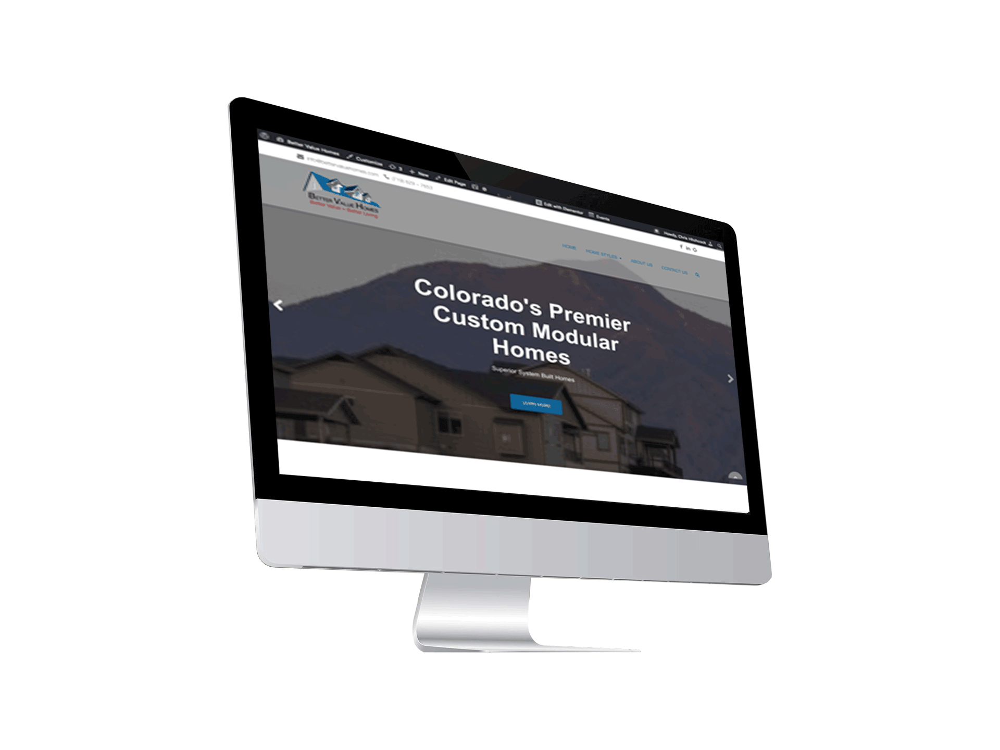
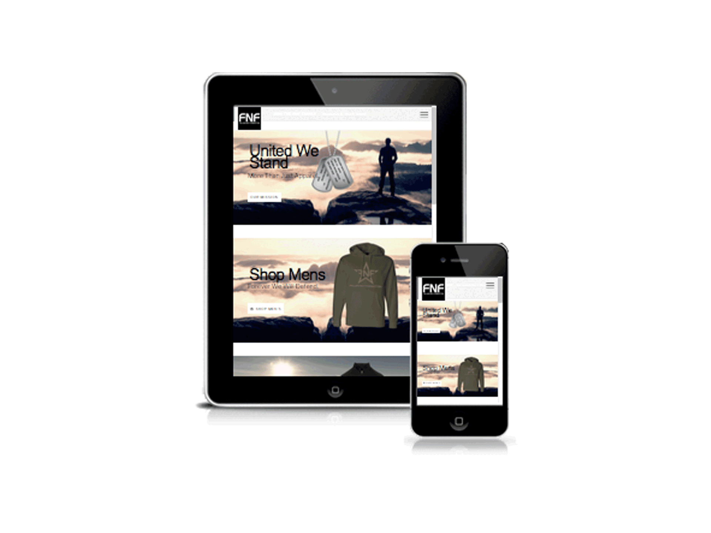
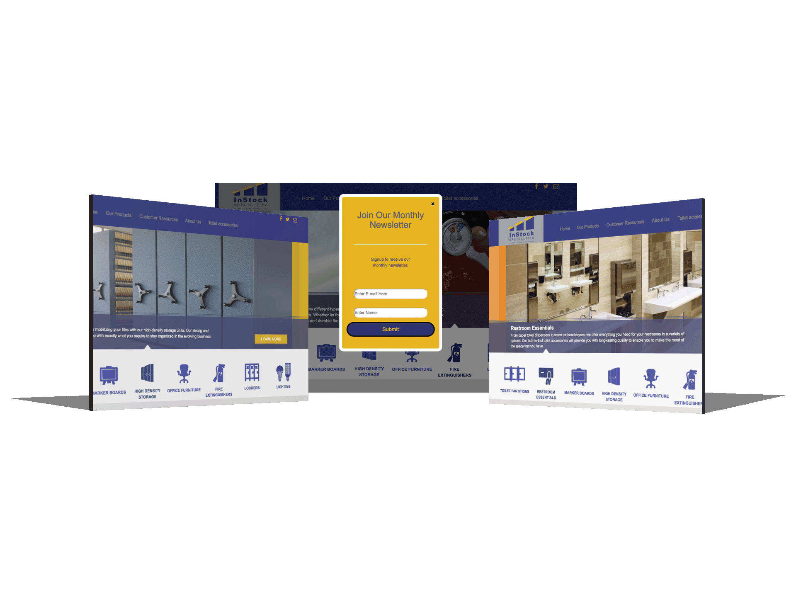
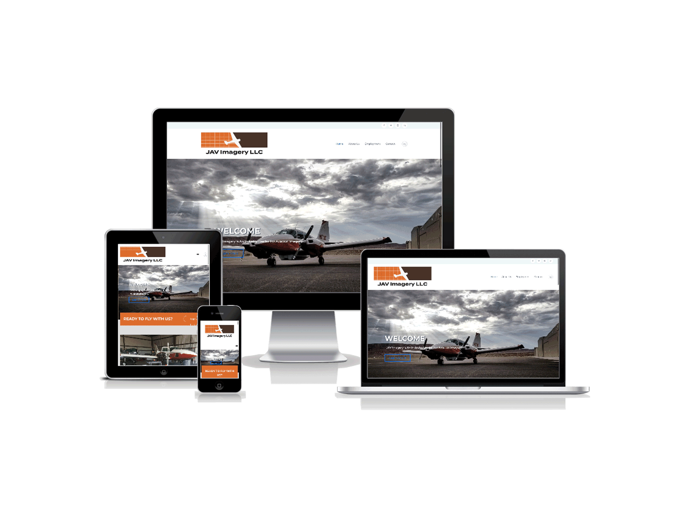
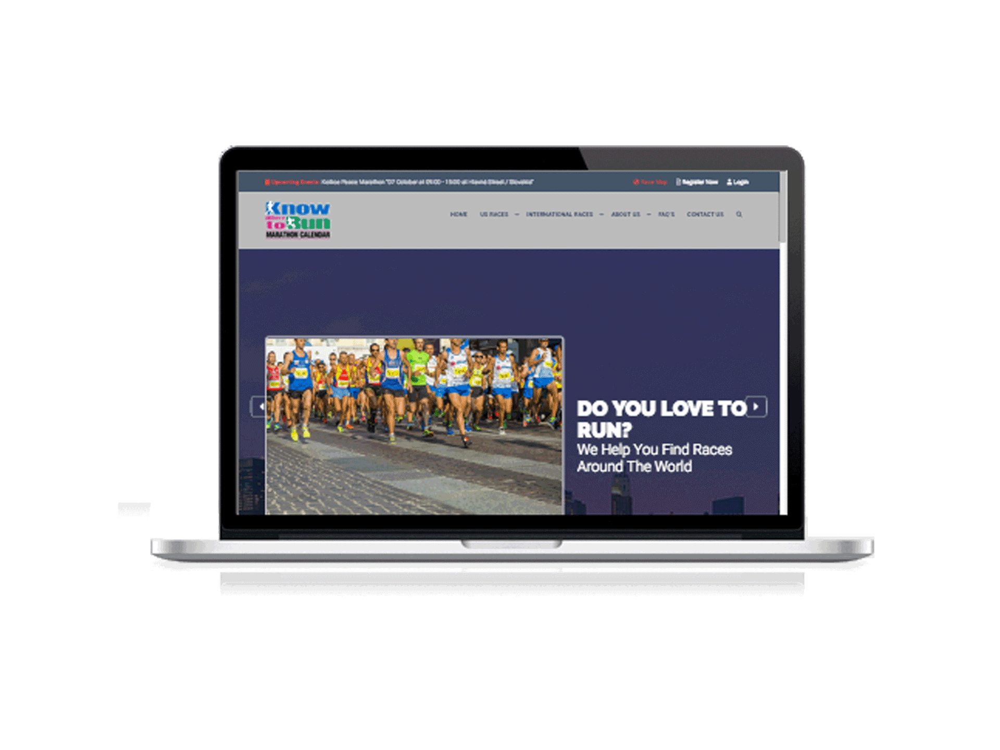
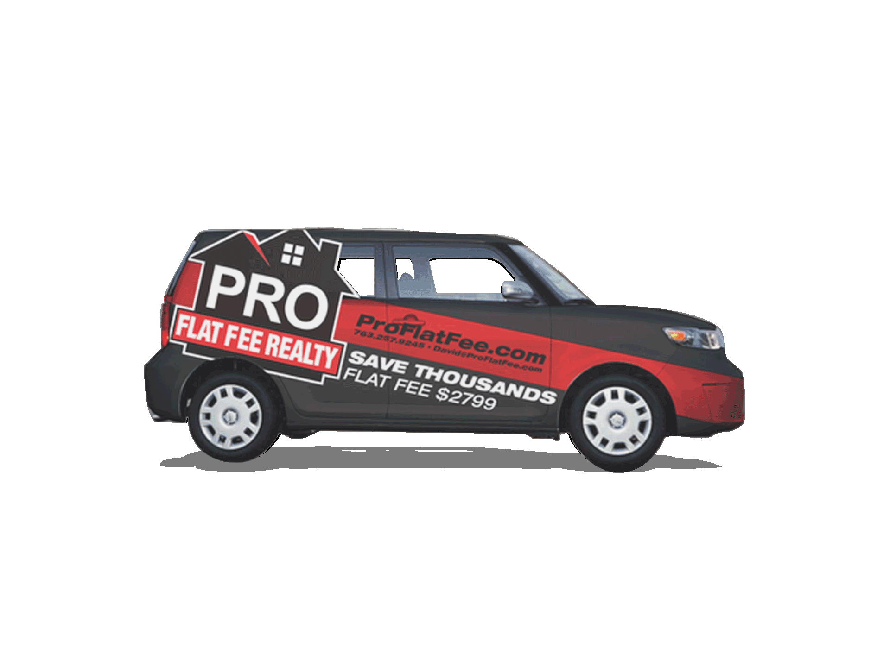
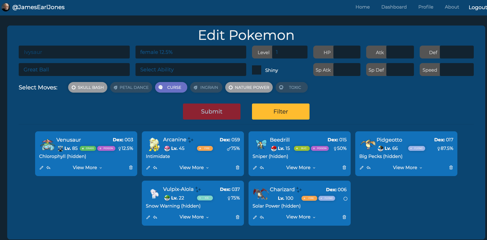

# Portfolio Proposal

This proposal is intended to identify multiple questions and answers about creating a new portfolio website for myself using my LLC Visionary Creatives

## Target Audience

<b>Small general business owners typically with lower technical knowledge</b>

- SBO have limited time and not a lot of extra resources (Adams, 2018)
- Need time saving solutions (Bluemner, 2014)
- Cannot typically take chance on unproven marketing - need tried and tested (Bluemner, 2014)
- Establishing trust early is a must (Adams, 2018)
- SBO's are interested in cutting edge technology (Digeldein & Hoppe, 2018)
- 1/4 of Business owners said revenue growth was their goal (Digeldein & Hoppe, 2018)

This will be a free-lance portfolio website. Looking back at my previous clients I have found that the typical client base I have had has been men in their late 30s to early 50s. In most scenarios I have been dealing directly with the owner of the business or rarely another person who works directly under the boss. In either case this has typically been the decision maker both for monetary concerns as well as development and design decisions. This is further supported in Adams' research that it is usually one maybe two people, and wearing many hats. (Adams, 2018)

Most often the business is existing and already has a website. They often come looking for either a website or application. They typically if the former, need a facelift on the site, additional functionality, or the ability to drive more traffic, sometimes all of the above. Applications typically are brand new and pointed specifically at a new feature they would like to have implemented. As illustrated in points by Bluemner these both need to be shown as time saving and proven. (Bluemner, 2018)

With the often lack of knowledge, they typically come with few resources and a vague idea of what they want. After some questions I am typically able to determine what content and resources will be needed and what their intent is. As they normally come lacking here, they often need help implementing and getting content. These clients also typically require some design work as well.

## Objective

The objective of this new portfolio site is to serve as new marketing material for Visionary Creatives (my company - I already have my LLC, DBA, and EIN).

This site will focus on how we partner with the small business to bring a solution to their need. With their busy schedule and lower technical understanding, high level overview will be used to show how this will be accomplished. This will help to build trust early by showing expertise in the field. This also helps show how we will save them time as illustrated in Adams' research that they don't have a lot due to minimal resources and many hats (Adams, 2018)

It will illustrate how we take that portion our of their hands to free them up to focus on their expertise, while we focus on ours. A high level overview of what new technologies are used will be shown to illustrate the business owner will start off ahead of the game to reinforce the point made by Digeldein & Hoppe. (Digeldein & Hoppe, 2018)

I would like to drive home the idea that we can provide assistance with things like optimization, SEO, accessibility, and brand development alongside the application and website creation. In doing this brief description of why that is or should be important to their site or application will be provided. This will illustrate how this can help with revenue growth which is shown as important in research. (Digeldein & Hoppe, 2018)

I always have had the intention of building a blog and at one point had started one as well. I intend to include this as well. I believe this will further help establish expertise which will be an additional way to grow trust.

### Important take aways

- Build trust by showing expertise
- Focus on high level overview (low tech jargon and overall finished sites and applications)
- Show how our expertise will solve their identified problem
- Illustrate partnering with to take portion off their hands and save time
- Give example of what SEO and optimization can do to increase traffic and revenue

## Tech Stack

- Next.js
- React.js
- Express.js
- Node.js
- Redux (possibly) - This may potentially be useContext and providers instead
- Bootstrap (possibly) - most development as of late has just been components with CSS Grid
- Sequelize
- Database - Unsure if I need to host this or can be run through vercel - Additional research needed
- Hosting: Vercel with thevisioncreatives.com domain

## Contact Information

Name: Visionary Creatives
Resume: LLC Site - should this be included?
Contact Information:

- email: chris@thevisioncreatives
- second email: info@thevisioncreatives
- Phone: (702) 462-4682

Location: Las Vegas, Nevada

### Portfolio Images

Have multiple existing full build websites with images already for portfolio. Will also be highlighting a live chat vue application, my capstone project, and a plugin for video upload and voting.

#### <b>Better Value Homes</b>

- This full site was created as an informational site to drive home buyers to the respective information they needed for a new build. It is complete with full custom filtering and sorting based off what the user is looking for.
  

#### <b>Fallen Not Forgotten</b>

- FNF is the eccommerce portion of a not for profit site. This site was created with a portion of each sale going to benefit the families of those who fell in the line of duty. This is a full eccommerce implementation with hundreds of products with multiple variations.
  

#### <b>Instock Specialties</b>

- Instock specialties is an informational site for business to business. They specialize in building fixtures and amentities. This site was created to organize those by category and
  

#### <b>JAV Imagery</b>

- This is an informational site that was created to give employees a way to apply for and check on their existing applications. It gives information about the company and what to expect in one of the positions.
  

#### <b>Know Where To Run</b>

- This site is a marathon tracking system. It is integrated using APIs to allow the users to register directly on the website for the respective marathon they are looking for. Users can search for these races in various ways whether by state, name, length, or even international.
  

#### <b>Pro Flat Fee</b>

- This is a design illustration of the car wrap that was created for use for this real estate company. The design was implemented and can still be seen driving around in Minnesota.
  

#### <b>Swapemon</b>

- This project was built using React and Redux to give users better ability to manage and trade their pokemon to other users. It is complete with user chat as well to discuss potential trades.

I will also be adding some additional images and projects, potentially working snippets from other projects. These projects will illustrate the use of newer technologies such as vue and react. I need to check whether I can use the code directly or if I need to edit it because it may be exclusive. Specifically there is a site that is scraping inputs from indeed and showing all of their clients' job postings using react and custom rss feed. Another is a custom react project consuming a video api from youtube to present the client's videos utilizing a playlist and slider. Another using Vue.js and Firebase to allow users to upload videos, vote and comment and award winners (think American Idol meets battle of the bands meets YouTube). The last project would be a project tracking application utilizing react to give the user project upload with full CRUD capabilities. I should have these answers in the coming week and either begin refactoring the code to make them brandless or include them directly.

## Citations

Mike Adams. (2018) How to tailor your approach to target small business owners | B2B Marketing. Retrieved March 06, 2021, from https://www.b2bmarketing.net/en/resources/blog/how-tailor-your-approach-target-small-business-owners

Adam Bluemner. (2014) 15 Experts Share Their Best Practices for Marketing to Small Businesses. Retrieved March 06, 2021, from https://softwareconnect.com/marketing/15-experts-share-best-practices-for-marketing-to-small-businesses/

Tirena Digeldein & Geoff Hoppe. (2018) Marketing to Small Business Owners: What Your Customers Need You to Know. Retrieved March 06, 2021, from https://blog.capterra.com/marketing-to-small-business-owners/
